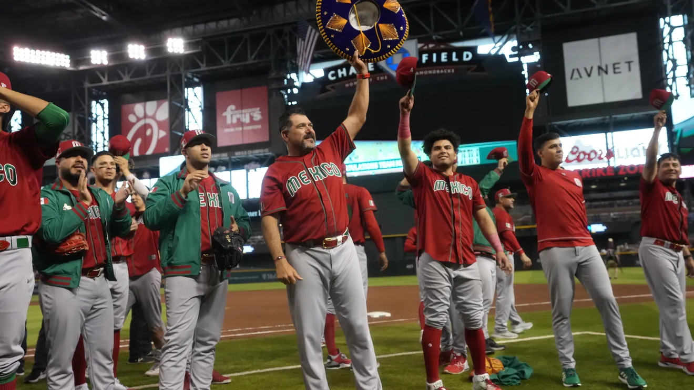

```{r setup, include=FALSE}
knitr::opts_chunk$set(echo = FALSE)
```

Mexico has traditionally been a strong baseball nation, with a deep pool of talented players both domestically and abroad. Their roster for the 2023 World Baseball Classic is no exception, featuring a number of Major League Baseball (MLB) stars, including pitchers Julio Urías and Marco Estrada, and outfielder Alex Verdugo.
 
In addition to their MLB talent, Mexico also boasts a strong domestic league in the Liga Mexicana de Beisbol, which has produced a number of players who have gone on to play professionally in the US and elsewhere. This gives them a deep pool of talent to draw from, and allows them to field a team with a mix of experienced veterans and up-and-coming young players.
 
Mexico's strengths on the field include a strong pitching staff, led by Urías and Estrada, who have both been successful at the MLB level. They also have a number of power hitters, including Verdugo and infielder Luis Urías, who can change the game with one swing of the bat.
 
In their opening game of the 2023 World Baseball Classic, Colombia beat Mexico 5-4 in an extra-innings thriller. Reynaldo Rodriguez led Colombia with a two-run home run in the 5th inning and a go-ahead RBI single in the 7th inning. The game started as a pitching duel, but turned into a shootout before returning to a pitching duel. Colombia had to use multiple pitchers, but they have a day off to recover, while Mexico will need to use their pitchers again in their upcoming game against the USA. If either team loses to Canada or Great Britain, their campaign could end.
 


