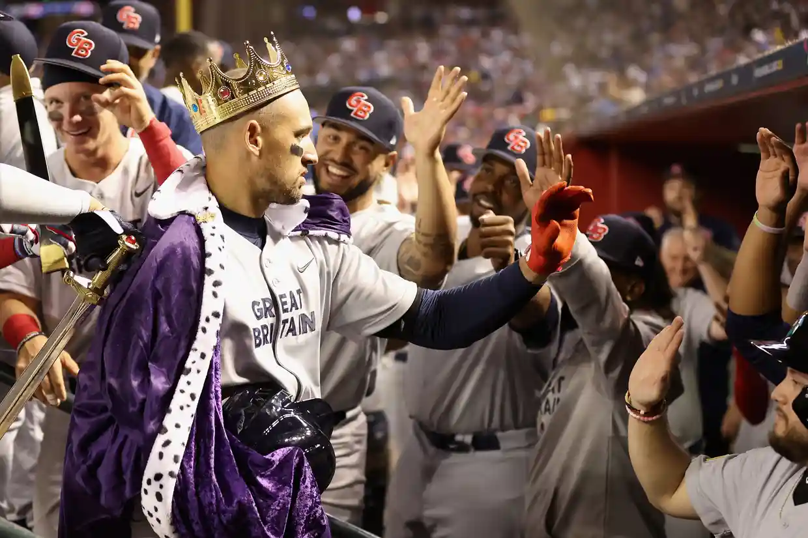

```{r setup, include=FALSE}
knitr::opts_chunk$set(echo = FALSE)
```



Certainly. In the first game of Pool C at the 2023 World Baseball Classic, the United States faced off against Great Britain, and the Americans came away with a convincing 6-2 victory. The United States had a potent lineup on paper, and in practice, they proved it, with multiple players delivering strong performances.

Kyle Schwarber was a standout player for the United States, hitting a three-run homer that sailed past the pool beyond the right-center-field fence. The crowd of 39,650 at Chase Field erupted into cheers as Schwarber crossed home plate and high-fived Mike Trout and Paul Goldschmidt. Nolan Arenado was also a major contributor to the American victory, collecting three hits and two RBIs, including a pair of RBI doubles.

Although Great Britain got off to a good start with Trayce Thompson hitting a homer off Adam Wainwright in the first inning, the United States quickly responded and took control of the game. Wainwright pitched four innings, giving up one run and five hits, and the bullpen trio of Jason Adam, Kyle Freeland, and David Bednar finished the game strongly, allowing just three hits while striking out six.

Former big league pitcher Vance Worley gave up two unearned runs over 2 2/3 innings for Great Britain. Thompson, who tied his career high with 13 homers last season for the Dodgers, finished with two hits.


